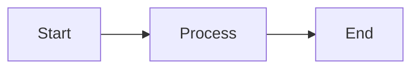
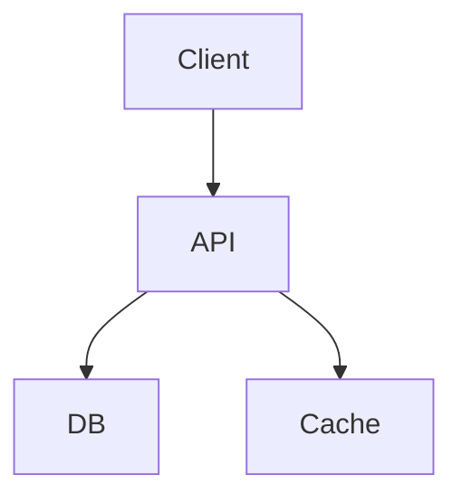
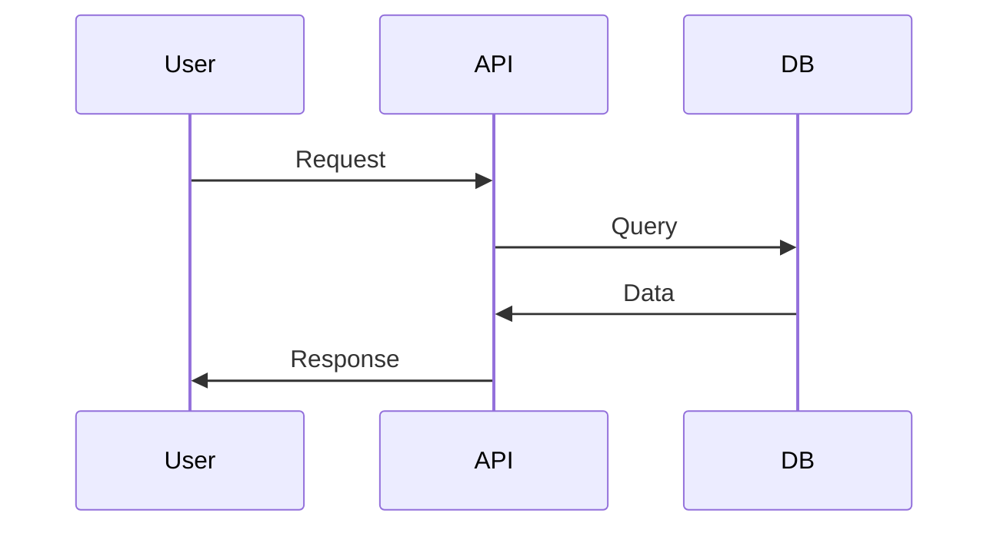

# Best Practices

# Best Practices

Bewährte Methoden für die Erstellung professioneller Dokumentation mit dem Documentation MCP Server.

## 📁 Projekt-Organisation

### Klare Struktur

```
projekt/
├── src/                    # Quellcode
├── docs/                   # Dokumentation
│   ├── docs/              # Markdown-Seiten
│   │   ├── intro.md
│   │   ├── guides/
│   │   ├── api/
│   │   └── reference/
│   ├── static/            # Bilder, Assets
│   └── docusaurus.config.js
├── README.md
└── CHANGELOG.md
```

### Namenskonventionen

- **Dateien:** Kleinbuchstaben, Bindestriche: `getting-started.md`
- **Titel:** Klar und beschreibend: "Getting Started Guide"
- **Kategorien:** Konsistent gruppieren: guides, tutorials, reference, api

## ✍️ Content-Qualität

### Struktur einer guten Seite

```markdown
# Klarer Titel

Kurze Einleitung (1-2 Sätze)

## Was Sie lernen werden

- Punkt 1
- Punkt 2

## Voraussetzungen

Was der Leser wissen/haben sollte

## Schritt-für-Schritt Anleitung

### Schritt 1: ...
### Schritt 2: ...

## Beispiele

Praktische Code-Beispiele

## Nächste Schritte

Links zu verwandten Themen
```

### Code-Beispiele

**✅ Gut:**
```typescript
// Vollständiges, lauffähiges Beispiel
import { MyClass } from 'my-library';

const instance = new MyClass({
  option1: true,
  option2: 'value'
});

const result = await instance.process();
console.log(result);
```

**❌ Schlecht:**
```typescript
// Unvollständiger Code
const instance = new MyClass();
// ... mach irgendwas
```

### Erklärungen

- **Warum** etwas gemacht wird, nicht nur **wie**
- **Use Cases** beschreiben
- **Häufige Fehler** erwähnen
- **Alternativen** aufzeigen

## 🔄 Workflow-Empfehlungen

### 1. Analyse zuerst

```typescript
// Immer mit Analyse beginnen
const analysis = await docs_analyze_project({
  projectPath: "./my-project",
  language: "typescript"
});

// Empfehlungen beachten
console.log(analysis.suggestions);
```

### 2. Schrittweise aufbauen

```typescript
// Schritt 1: Struktur
await docs_generate_structure({ ... });

// Schritt 2: API-Docs
await docs_generate_api({ ... });

// Schritt 3: Custom Pages
await docs_create_page({ ... });

// Schritt 4: Testen
await docs_preview({ ... });

// Schritt 5: Build
await docs_build_static({ ... });
```

### 3. Iterativ verbessern

- Feedback einholen
- Regelmäßig aktualisieren
- Tote Links prüfen
- Veralteten Content entfernen

## 📝 Markdown Best Practices

### Überschriften-Hierarchie

```markdown
# H1 - Nur einmal pro Seite (Titel)
## H2 - Hauptabschnitte
### H3 - Unterabschnitte
#### H4 - Details (sparsam verwenden)
```

### Links

```markdown
<!-- Interne Links (relativ) -->
[Andere Seite](./other-page.md)
[Tool-Docs](../tools/overview.md)

<!-- Externe Links -->
[GitHub](https://github.com)

<!-- Mit Titel -->
[Link Text](url "Hover Title")
```

### Listen

```markdown
<!-- Ungeordnet -->
- Punkt 1
- Punkt 2
  - Unterpunkt
  - Unterpunkt

<!-- Geordnet -->
1. Erster Schritt
2. Zweiter Schritt
3. Dritter Schritt

<!-- Checkliste -->
- [ ] Aufgabe 1
- [x] Aufgabe 2 (erledigt)
```

### Hervorhebungen

```markdown
**Fett** für wichtige Begriffe
*Kursiv* für Betonung
`Code` für Inline-Code
> Zitate oder wichtige Hinweise
```

## 🎨 Visuelle Elemente

### Wann Diagramme verwenden

```markdown
<!-- Workflows -->


<!-- Architektur -->


<!-- Sequenzen -->

```

### Screenshots

- **Hochwertig:** Mindestens 1200px Breite
- **Beschriftet:** Mit Annotationen
- **Aktuell:** Regelmäßig aktualisieren
- **Optimiert:** WebP oder komprimierte PNG

## 🌐 Internationalisierung

### Von Anfang an planen

```typescript
// Strings externalisieren
const messages = {
  de: {
    welcome: "Willkommen",
    guide: "Anleitung"
  },
  en: {
    welcome: "Welcome",
    guide: "Guide"
  }
};
```

### Struktur für i18n

```
docs/
├── i18n/
│   ├── de/
│   │   └── docusaurus-plugin-content-docs/
│   └── en/
│       └── docusaurus-plugin-content-docs/
```

## 🚀 Performance

### Build-Optimierung

```bash
# Nur notwendige Dateien builden
# Große Assets extern hosten
# Lazy Loading für Bilder
# Code-Splitting aktivieren
```

### Preview-Performance

```bash
# Cache nutzen
# Nur geänderte Seiten rebuilden
# Fast Refresh aktivieren
```

## 🔍 SEO Best Practices

### Metadaten

```markdown
---
title: Mein Titel
description: Kurze Beschreibung (150-160 Zeichen)
keywords: [keyword1, keyword2, keyword3]
---
```

### URL-Struktur

```
✅ Gut:  /docs/guides/getting-started
❌ Schlecht: /docs/page1
```

### Sitemap

```javascript
// docusaurus.config.js
module.exports = {
  presets: [
    [
      '@docusaurus/preset-classic',
      {
        sitemap: {
          changefreq: 'weekly',
          priority: 0.5,
        },
      },
    ],
  ],
};
```

## 📊 Metriken & Tracking

### Was messen?

- Besucherzahlen pro Seite
- Suchbegriffe
- Absprungrate
- Verweildauer
- Häufige 404s

### Tools

- Google Analytics
- Plausible
- Matomo
- Custom Logging

## 🔄 Wartung

### Regelmäßige Aufgaben

**Wöchentlich:**
- Neue Features dokumentieren
- Bugs in Docs fixen

**Monatlich:**
- Links überprüfen
- Screenshots aktualisieren
- Metriken analysieren

**Quartalsweise:**
- Große Überarbeitung
- Veralteten Content entfernen
- Navigation optimieren

### Changelog pflegen

```markdown
# Changelog

## [2.0.0] - 2024-01-15
### Added
- New feature X
### Changed
- Improved Y
### Deprecated
- Old API method Z
### Removed
- Unused feature A
### Fixed
- Bug in B
```

## 👥 Team-Collaboration

### Docs-Reviews

- Peer-Review für neue Seiten
- Style Guide einhalten
- Feedback-Loop etablieren

### CI/CD Integration

```yaml
# .github/workflows/docs.yml
name: Deploy Docs
on:
  push:
    branches: [main]
jobs:
  deploy:
    runs-on: ubuntu-latest
    steps:
      - uses: actions/checkout@v2
      - name: Build docs
        run: |
          cd docs
          npm install
          npm run build
      - name: Deploy
        uses: peaceiris/actions-gh-pages@v3
```

## 💡 Finale Tipps

1. **Zielgruppe im Fokus** - Schreiben Sie für Ihre Nutzer
2. **Einfach starten** - Perfektion später
3. **Konsistenz** - Einheitlicher Stil
4. **Suche optimieren** - Gute Keywords
5. **Feedback einholen** - Von echten Nutzern
6. **Versionierung** - Docs pro Release-Version
7. **Barrierefreiheit** - Alt-Texte, klare Sprache
8. **Mobile-First** - Responsive Design testen
