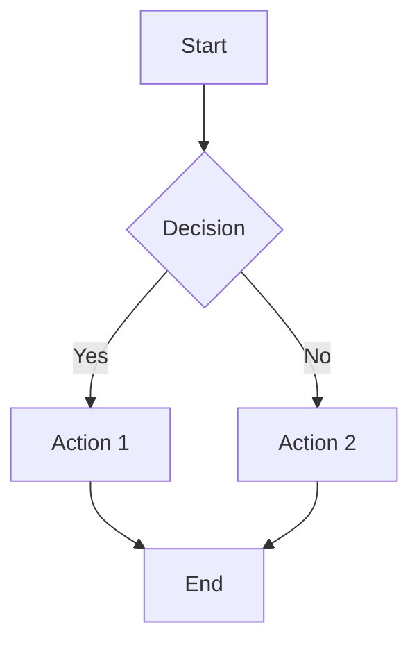

# Beispiele

# Praktische Beispiele

Sammlung von praktischen Beispielen für häufige Anwendungsfälle.

## 📚 Inhaltsverzeichnis

- [TypeScript Library dokumentieren](#typescript-library)
- [Python API dokumentieren](#python-api)
- [Multi-Package Monorepo](#monorepo)
- [Bestehende Docs erweitern](#erweitern)
- [PDF-Export für Offline](#pdf-export)

---

## TypeScript Library

### Szenario
Sie haben eine TypeScript-Bibliothek und möchten eine moderne Dokumentation mit Docusaurus.

### Lösung

```typescript
// 1. Analysieren
const analysis = await docs_analyze_project({
  projectPath: "./my-library",
  language: "typescript"
});

// 2. Struktur mit Docusaurus
await docs_generate_structure({
  projectPath: "./my-library",
  framework: "docusaurus",
  template: "classic",
  outputPath: "./my-library/documentation"
});

// 3. TypeDoc für API-Referenz
await docs_generate_api({
  projectPath: "./my-library/src",
  outputPath: "./my-library/documentation/docs/api",
  language: "typescript"
});

// 4. README-Inhalt als Intro übernehmen
const readmeContent = fs.readFileSync("./my-library/README.md", "utf-8");
await docs_create_page({
  docsPath: "./my-library/documentation",
  pagePath: "docs/intro.md",
  title: "Introduction",
  content: readmeContent
});

// 5. Zusätzliche Guides
await docs_create_page({
  docsPath: "./my-library/documentation",
  pagePath: "docs/guides/installation.md",
  title: "Installation",
  content: `# Installation

## npm
\`\`\`bash
npm install my-library
\`\`\`

## yarn
\`\`\`bash
yarn add my-library
\`\`\`

## Quick Start
\`\`\`typescript
import { MyClass } from 'my-library';

const instance = new MyClass();
console.log(instance.hello());
\`\`\`
`
});

// 6. Preview
await docs_preview({
  docsPath: "./my-library/documentation",
  framework: "docusaurus"
});
```

**Ergebnis:** Vollständige Dokumentation mit API-Referenz und Guides.

---

## Python API

### Szenario
FastAPI-Backend dokumentieren mit MkDocs.

### Lösung

```typescript
// 1. Analysieren
await docs_analyze_project({
  projectPath: "./my-api",
  language: "python"
});

// 2. MkDocs-Struktur
await docs_generate_structure({
  projectPath: "./my-api",
  framework: "mkdocs",
  outputPath: "./my-api/docs"
});

// 3. API-Docs mit Sphinx
await docs_generate_api({
  projectPath: "./my-api/app",
  outputPath: "./my-api/docs/api",
  language: "python"
});

// 4. API-Endpoints dokumentieren
await docs_create_page({
  docsPath: "./my-api/docs",
  pagePath: "docs/api-endpoints.md",
  title: "API Endpoints",
  content: `# API Endpoints

## Users

### GET /users
Retrieve all users.

**Response:**
\`\`\`json
{
  "users": [
    {"id": 1, "name": "Alice"},
    {"id": 2, "name": "Bob"}
  ]
}
\`\`\`

### POST /users
Create a new user.

**Request Body:**
\`\`\`json
{
  "name": "Charlie",
  "email": "charlie@example.com"
}
\`\`\`

**Response:**
\`\`\`json
{
  "id": 3,
  "name": "Charlie",
  "email": "charlie@example.com"
}
\`\`\`
`
});

// 5. Authentifizierung dokumentieren
await docs_create_page({
  docsPath: "./my-api/docs",
  pagePath: "docs/authentication.md",
  title: "Authentication",
  content: `# Authentication

## JWT Tokens

This API uses JWT (JSON Web Tokens) for authentication.

### Getting a Token

\`\`\`bash
curl -X POST http://localhost:8000/auth/login \\
  -H "Content-Type: application/json" \\
  -d '{"username": "user", "password": "pass"}'
\`\`\`

### Using the Token

\`\`\`bash
curl -X GET http://localhost:8000/users \\
  -H "Authorization: Bearer YOUR_TOKEN_HERE"
\`\`\`
`
});
```

**Ergebnis:** Strukturierte API-Dokumentation mit Endpoints und Beispielen.

---

## Monorepo

### Szenario
Monorepo mit Frontend (React) und Backend (Node.js) - separate Dokumentationen.

### Lösung

```typescript
// Analyse des gesamten Repos
const overallAnalysis = await docs_analyze_project({
  projectPath: "./monorepo"
});

// Frontend-Dokumentation (Docusaurus)
await docs_generate_structure({
  projectPath: "./monorepo/packages/frontend",
  framework: "docusaurus",
  template: "classic",
  outputPath: "./monorepo/docs/frontend"
});

await docs_create_page({
  docsPath: "./monorepo/docs/frontend",
  pagePath: "docs/components.md",
  title: "Components",
  content: `# React Components

## Button
\`\`\`tsx
import { Button } from '@myapp/ui';

<Button variant="primary" onClick={handleClick}>
  Click Me
</Button>
\`\`\`
`
});

// Backend-Dokumentation (Docusaurus)
await docs_generate_structure({
  projectPath: "./monorepo/packages/backend",
  framework: "docusaurus",
  template: "classic",
  outputPath: "./monorepo/docs/backend"
});

await docs_generate_api({
  projectPath: "./monorepo/packages/backend/src",
  outputPath: "./monorepo/docs/backend/docs/api",
  language: "typescript"
});

// Haupt-Übersichtsseite
await docs_create_page({
  docsPath: "./monorepo/docs/frontend",
  pagePath: "docs/overview.md",
  title: "Project Overview",
  content: `# Project Overview

## Architecture

\`\`\`mermaid
graph LR
    A[Frontend React] --> B[API Gateway]
    B --> C[Backend Services]
    C --> D[Database]
\`\`\`

## Documentation

- [Frontend Docs](../frontend)
- [Backend API](../backend)

## Packages

- **@myapp/ui** - React component library
- **@myapp/backend** - Node.js API server
- **@myapp/shared** - Shared utilities
`
});
```

**Ergebnis:** Separate Dokumentationen pro Package mit zentraler Übersicht.

---

## Bestehende Docs erweitern

### Szenario
Sie haben bereits Dokumentation und möchten neue Seiten hinzufügen.

### Lösung

```typescript
// Keine Neu-Generierung nötig, direkt Pages erstellen

// Neue Feature-Dokumentation
await docs_create_page({
  docsPath: "./existing-docs",
  pagePath: "docs/features/new-feature.md",
  title: "New Feature",
  content: `# New Feature

Released in v2.0.0

## Overview
This feature allows you to...

## Usage
\`\`\`typescript
import { newFeature } from 'my-lib';

newFeature({
  option1: true,
  option2: 'value'
});
\`\`\`

## Configuration
...
`
});

// Migration Guide
await docs_create_page({
  docsPath: "./existing-docs",
  pagePath: "docs/guides/migration-v2.md",
  title: "Migration to v2",
  content: `# Migration Guide: v1 to v2

## Breaking Changes

### Renamed Functions
- \`oldFunction()\` → \`newFunction()\`
- \`getData()\` → \`fetchData()\`

### Changed Signatures
\`\`\`typescript
// v1
function process(data: string): void

// v2
function process(data: string, options?: ProcessOptions): Promise<void>
\`\`\`

## Step-by-Step Migration

1. Update imports
2. Rename function calls
3. Add async/await where needed
4. Test thoroughly
`
});

// Changelog-Seite
await docs_create_page({
  docsPath: "./existing-docs",
  pagePath: "docs/changelog.md",
  title: "Changelog",
  content: `# Changelog

## [2.0.0] - 2024-01-15

### Added
- New feature X
- Support for Y

### Changed
- Improved performance
- Updated dependencies

### Breaking Changes
- See [Migration Guide](./guides/migration-v2.md)

## [1.5.0] - 2023-12-01

### Added
- Feature A
- Feature B
`
});
```

**Ergebnis:** Nahtlose Erweiterung bestehender Dokumentation.

---

## PDF Export

### Szenario
Dokumentation als PDF für Offline-Nutzung oder Archivierung.

### Lösung

```typescript
// Vollständige Dokumentation als PDF
await docs_export_pdf({
  docsPath: "./docs",
  outputPath: "./documentation-complete.pdf"
});

// Nur spezifische Seiten
await docs_export_pdf({
  docsPath: "./docs",
  outputPath: "./getting-started-guide.pdf",
  includePages: [
    "intro.md",
    "guides/installation.md",
    "guides/getting-started.md"
  ]
});

// API-Referenz separat
await docs_export_pdf({
  docsPath: "./docs",
  outputPath: "./api-reference.pdf",
  includePages: ["api/*"]
});
```

**Ergebnis:** PDF-Dateien mit Inhaltsverzeichnis und Styling.

---

## 🎨 Code-Beispiele formatieren

### Syntax Highlighting

````markdown
```typescript
// TypeScript Code
interface User {
  id: number;
  name: string;
}
```

```python
# Python Code
def hello(name: str) -> str:
    return f"Hello, {name}!"
```

```bash
# Shell Commands
npm install
npm start
```
````

### Interaktive Beispiele

````markdown
```typescript live
function Example() {
  return <button>Click Me</button>;
}
```
````

---

## 📊 Diagramme einbinden

### Mermaid-Diagramme

````markdown

````

---

## 🖼️ Bilder und Medien

```typescript
await docs_create_page({
  docsPath: "./docs",
  pagePath: "docs/visual-guide.md",
  title: "Visual Guide",
  content: `# Visual Guide

## Screenshots


## Architecture Diagram


## Video Tutorial

<video width="100%" controls>
  <source src="./videos/tutorial.mp4" type="video/mp4">
</video>
`
});
```

---

## 💡 Tipps

1. **Konsistenz:** Halten Sie Struktur und Stil einheitlich
2. **Code-Beispiele:** Immer lauffähige Beispiele verwenden
3. **Versionierung:** Changelog pflegen
4. **Suchbarkeit:** Gute Überschriften und Keywords
5. **Verlinkung:** Interne Links zwischen Seiten nutzen
