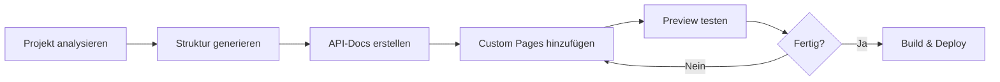

# Einführung

# Willkommen beim Documentation MCP Server

Der **Documentation MCP Server** ist ein leistungsstarker Model Context Protocol (MCP) Server, der entwickelt wurde, um professionelle Dokumentationen automatisch zu generieren und zu verwalten.

## 🎯 Was ist der Documentation MCP Server?

Dieser Server bietet eine umfassende Lösung für:

- **Automatische Code-Analyse** - Versteht Ihre Projektstruktur und extrahiert relevante Informationen
- **Multi-Framework-Support** - Unterstützt Docusaurus, MkDocs und Sphinx
- **API-Dokumentation** - Generiert API-Docs aus Ihrem Code (JSDoc, Docstrings, etc.)
- **Flexible Ausgabe** - Erstellt Websites, PDFs oder Markdown-Dateien

## 🚀 Schnellstart

1. **Installation**
   ```bash
   npm install
   npm run build
   ```

2. **MCP Server konfigurieren**
   Fügen Sie den Server zu Ihrer MCP-Konfiguration hinzu (siehe [Setup](./setup.md))

3. **Erste Dokumentation erstellen**
   ```typescript
   // Projekt analysieren
   await docs_analyze_project({
     projectPath: "./mein-projekt",
     language: "typescript"
   });
   
   // Struktur generieren
   await docs_generate_structure({
     projectPath: "./mein-projekt",
     framework: "docusaurus"
   });
   ```

## 💡 Hauptfeatures

### 🔍 Intelligente Projekt-Analyse
Analysiert automatisch Ihre Codebase und identifiziert:
- Projektstruktur und Dateihierarchie
- Verwendete Programmiersprachen
- Wichtige Module und Komponenten
- Empfohlene Dokumentations-Frameworks

### 🏗️ Strukturierte Dokumentation
Erstellt professionelle Dokumentations-Gerüste mit:
- Vorkonfigurierten Templates
- Navigationsstruktur
- Styling und Themes
- Best-Practice-Organisation

### ✍️ Flexibler Content-Editor
Ermöglicht das Erstellen und Bearbeiten von:
- Markdown-Seiten
- Tutorials und Guides
- Code-Beispiele
- Diagramme und Visualisierungen

## 🛠️ Unterstützte Technologien

### Programmiersprachen
- TypeScript / JavaScript
- Python
- Go
- Rust
- Java
- C#

### Dokumentations-Frameworks
- **Docusaurus** - Modern, React-basiert, ideal für Projekte mit vielen Interaktionen
- **MkDocs** - Python-basiert, einfach, perfekt für Python-Projekte
- **Sphinx** - Sehr mächtig, etabliert in der Python-Community

### Export-Formate
- Statische Websites (HTML/CSS/JS)
- PDF-Dokumente
- Markdown-Dateien

## 📖 Dokumentations-Workflow



## 🎓 Nächste Schritte

- [Installation & Setup](./setup.md) - Detaillierte Installationsanleitung
- [Tools Übersicht](./tools/overview.md) - Alle verfügbaren Tools
- [Beispiele & Tutorials](./guides/getting-started.md) - Praktische Anleitungen
- [API-Referenz](./api/index.md) - Technische Details
