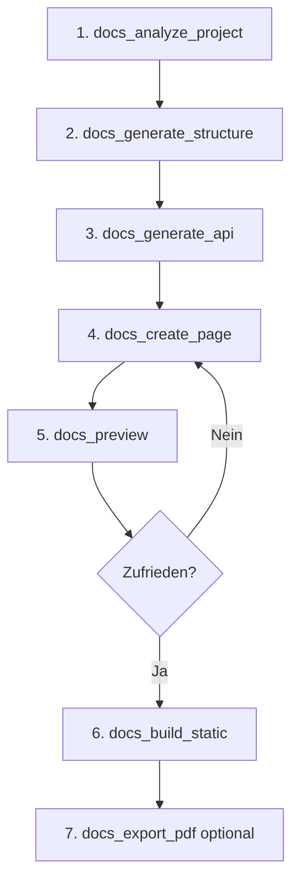

# Tools Übersicht

# Tools Übersicht

Der Documentation MCP Server bietet 7 leistungsstarke Tools für die Dokumentationserstellung.

## 📋 Alle Tools im Überblick

| Tool | Zweck | Komplexität |
|------|-------|-------------|
| [docs_analyze_project](#docs_analyze_project) | Projekt analysieren | ⭐ Einfach |
| [docs_generate_structure](#docs_generate_structure) | Doku-Gerüst erstellen | ⭐⭐ Mittel |
| [docs_create_page](#docs_create_page) | Einzelne Seiten erstellen | ⭐ Einfach |
| [docs_generate_api](#docs_generate_api) | API-Docs generieren | ⭐⭐ Mittel |
| [docs_preview](#docs_preview) | Lokale Vorschau | ⭐ Einfach |
| [docs_build_static](#docs_build_static) | Website bauen | ⭐⭐ Mittel |
| [docs_export_pdf](#docs_export_pdf) | PDF exportieren | ⭐⭐⭐ Fortgeschritten |

## 🔍 docs_analyze_project

Analysiert ein Projekt, um Struktur und Code zu verstehen.

**Anwendungsfälle:**
- Neues Projekt kennenlernen
- Dokumentations-Framework-Empfehlung erhalten
- Projektstruktur visualisieren

**Parameter:**
```typescript
{
  projectPath: string;      // Pfad zum Projekt (required)
  language?: string;        // Programmiersprache (optional)
}
```

**Unterstützte Sprachen:**
`typescript`, `javascript`, `python`, `go`, `rust`, `java`, `csharp`

**Beispiel:**
```typescript
await docs_analyze_project({
  projectPath: "./my-project",
  language: "typescript"
});
```

**Ausgabe:**
- Dateianzahl
- Verzeichnisstruktur
- Empfohlenes Framework
- Erkannte Muster

[→ Detaillierte Dokumentation](./analyze-project.md)

---

## 🏗️ docs_generate_structure

Erstellt das komplette Dokumentations-Gerüst mit konfigurierten Templates.

**Anwendungsfälle:**
- Neue Dokumentation initialisieren
- Framework-spezifische Struktur erstellen
- Templates anwenden

**Parameter:**
```typescript
{
  projectPath: string;      // Pfad zum Projekt (required)
  framework: string;        // "docusaurus" | "mkdocs" | "sphinx" (required)
  template?: string;        // Template-Name (optional)
  outputPath?: string;      // Ausgabepfad (optional, default: ./docs)
}
```

**Verfügbare Frameworks:**
- **Docusaurus** - Modern, React-basiert
  - Templates: `classic`, `facebook`, `meta`
- **MkDocs** - Python-basiert, Markdown-fokussiert
- **Sphinx** - Python, sehr mächtig

**Beispiel:**
```typescript
await docs_generate_structure({
  projectPath: "./my-project",
  framework: "docusaurus",
  template: "classic"
});
```

[→ Detaillierte Dokumentation](./generate-structure.md)

---

## ✍️ docs_create_page

Erstellt oder bearbeitet einzelne Dokumentationsseiten.

**Anwendungsfälle:**
- Neue Markdown-Seite erstellen
- Bestehende Seite aktualisieren
- Content hinzufügen

**Parameter:**
```typescript
{
  docsPath: string;         // Pfad zur Doku (required)
  pagePath: string;         // Relativer Pfad zur Seite (required)
  title: string;            // Seitentitel (required)
  content: string;          // Markdown-Inhalt (required)
}
```

**Beispiel:**
```typescript
await docs_create_page({
  docsPath: "./docs",
  pagePath: "guides/getting-started.md",
  title: "Getting Started",
  content: "# Getting Started\n\nWelcome to..."
});
```

[→ Detaillierte Dokumentation](./create-page.md)

---

## 📖 docs_generate_api

Generiert API-Dokumentation aus Code-Kommentaren.

**Anwendungsfälle:**
- API-Referenz aus JSDoc generieren
- Python Docstrings dokumentieren
- Code-Dokumentation automatisieren

**Parameter:**
```typescript
{
  projectPath: string;      // Pfad zum Quellcode (required)
  outputPath: string;       // Ausgabepfad (required)
  language: string;         // Programmiersprache (required)
}
```

**Unterstützte Tools:**
- **TypeScript/JavaScript:** TypeDoc
- **Python:** Sphinx, pdoc
- **Go:** godoc
- **Rust:** rustdoc

**Beispiel:**
```typescript
await docs_generate_api({
  projectPath: "./src",
  outputPath: "./docs/api",
  language: "typescript"
});
```

[→ Detaillierte Dokumentation](./generate-api.md)

---

## 👀 docs_preview

Startet einen lokalen Entwicklungsserver für Live-Vorschau.

**Anwendungsfälle:**
- Änderungen live testen
- Dokumentation lokal durchsuchen
- Vor Deployment validieren

**Parameter:**
```typescript
{
  docsPath: string;         // Pfad zur Doku (required)
  framework: string;        // Framework (required)
  port?: number;            // Port (optional, default: 3000/8000)
}
```

**Standard-Ports:**
- Docusaurus: `3000`
- MkDocs: `8000`
- Sphinx: `8000`

**Beispiel:**
```typescript
await docs_preview({
  docsPath: "./docs",
  framework: "docusaurus",
  port: 3000
});
```

[→ Detaillierte Dokumentation](./preview.md)

---

## 🌐 docs_build_static

Baut statische Website für Produktions-Hosting.

**Anwendungsfälle:**
- Production-Build erstellen
- Für GitHub Pages vorbereiten
- Auf Netlify/Vercel deployen

**Parameter:**
```typescript
{
  docsPath: string;         // Pfad zur Doku (required)
  framework: string;        // Framework (required)
  outputPath?: string;      // Ausgabepfad (optional, default: ./build)
}
```

**Ausgabe:**
- Optimierte HTML/CSS/JS
- SEO-freundlich
- Bereit für CDN-Deployment

**Beispiel:**
```typescript
await docs_build_static({
  docsPath: "./docs",
  framework: "docusaurus",
  outputPath: "./build"
});
```

[→ Detaillierte Dokumentation](./build-static.md)

---

## 📄 docs_export_pdf

Exportiert Dokumentation als PDF-Datei.

**Anwendungsfälle:**
- Offline-Dokumentation erstellen
- Druckbare Version generieren
- Archivierung

**Parameter:**
```typescript
{
  docsPath: string;         // Pfad zur Doku (required)
  outputPath: string;       // PDF-Ausgabepfad (required)
  includePages?: string[];  // Spezifische Seiten (optional)
}
```

**Features:**
- Inhaltsverzeichnis
- Seitenzahlen
- Hyperlinks
- Styling

**Beispiel:**
```typescript
await docs_export_pdf({
  docsPath: "./docs",
  outputPath: "./documentation.pdf",
  includePages: ["intro.md", "guides/*"]
});
```

[→ Detaillierte Dokumentation](./export-pdf.md)

---

## 🔄 Typischer Workflow



## 📚 Weitere Ressourcen

- [Beispiele & Tutorials](../guides/examples.md)
- [Best Practices](../guides/best-practices.md)
- [Troubleshooting](../guides/troubleshooting.md)
